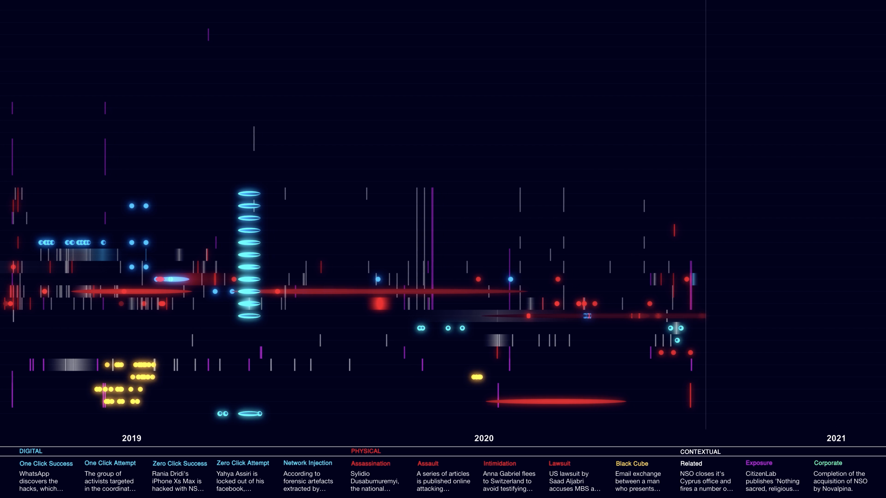

# Sound Machine

This repository contains the skeleton code for building a streaming audio infrastructure that consumes a temporal dataset and outputs MIDI messages. These MIDI messages can be intercepted by any DAW software that maps the MIDI codes to an appropriate virtual instrument.

The software was first developed for Forensic Architecture's investigation, [Digital Violence: How NSO Group Enables State Terror](https://forensic-architecture.org/investigation/digital-violence-how-the-nso-group-enables-state-terror), to generate a soundscape from underlying data, in collaboration with Brian Eno. The video containing the sonification can be found [here](https://vimeo.com/563641014)

The core of this system is a server that translates temporal data to MIDI codes according to a 'sound dictionary' at set intervals. These messages can then be captured and recorded by a DAW (in our case Ableton). The rationale behind this approach is that, while it can be used in a automated fashion, it also affords the creator to subsequently actuate the triggers with further parameters and manually curate the sound output.



In the `visuals` folder of is also an application that provides a 'debug' view of the software. It uses WebSockets to communicate with the Node.js audio server and the displays the messages visually in a React-based front-end.


### Running

The below will set up the front-end, which awaits WebSockets messages from the back-end.

```sh
cd visuals
npm install
npm run start
```

In order to run the back-end, you'll need to place and, optionally, pre-process some temporal JSON data.

```sh
cd server
npm run preprocess # optional
npm run start
```

This loops over the temporal data over a certain value of seconds (as provided in the command line arguments) and emits both WebSockets and MIDI outputs.


### Setting up Ableton
*To be filled*

#### Generating a soundfont from audio assets
*To be filled*

### Author
[@zacoppotamus](https://github.com/zacoppotamus)